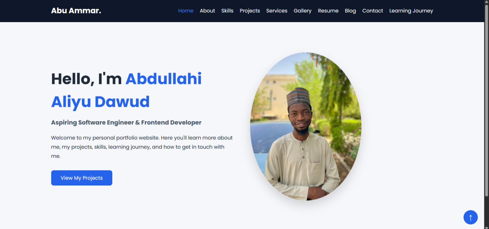

<!DOCTYPE html>
<html lang="en">
<head>
    <meta charset="UTF-8">
    <meta name="viewport" content="width=device-width, initial-scale=1.0">
    <title>Gallery | Abdullahi Aliyu Dawud</title>

    <link rel="stylesheet" href="css/style.css">

    <link href="https://fonts.googleapis.com/css2?family=Poppins:wght@300;400;600;700&display=swap" rel="stylesheet">
</head>
<body>

<header>

    <nav class="navbar">

        

            <h2>Abdullahi.</h2>
        

        <ul class="nav-links">
            <li><a href="index.html">Home</a></li>
            <li><a href="about.html">About</a></li>
            <li><a href="skills.html">Skills</a></li>
            <li><a href="projects.html">Projects</a></li>
            <li><a href="services.html">Services</a></li>
            <li><a href="gallery.html" class="active">Gallery</a></li>
            <li><a href="resume.html">Resume</a></li>
            <li><a href="blog.html">Blog</a></li>
            <li><a href="contact.html">Contact</a></li>
            <li><a href="learning.html">Learning Journey</a></li>
        </ul>

    </nav>

</header>

<section class="page-header">
    <h1>Gallery</h1>
    
A showcase of my projects and web development journey.

</section>

<section class="gallery-container">

    

        
    

    

        
    

    

        
    

    

        
    

    

        
    

    

        
    

    

        
    

    

        
    

</section>

<footer>

    
&copy; 2026 Abdullahi Aliyu Dawud. All Rights Reserved.

    

        <a href="#">GitHub</a>
        <a href="#">LinkedIn</a>
        <a href="#">Email</a>
    

</footer>
<a href="#" class="back-top">↑</a>
</body>
</html>